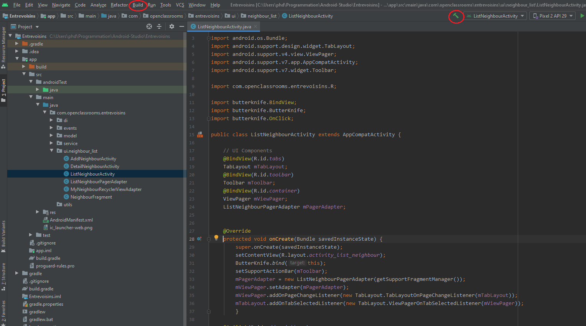

#  ENTREVOISINS

Ce dépôt contient l'application Entrevoisin.\
A suivre vous trouverez les instructions pour la récupération, la compilation et l'éxécution de ce projet.

## Récupération du projet sur GitHub :

* Vous pouvez récupérer le projet via un download direct à la racine de celui-ci :
* Ou encore cloner le dépôt en local.\
 Au choix en utilisant cette adresse ---> [Lien Entrevoisins](https://github.com/Philippe-DEBANDE/OC-DevAndroid-Projet3.git)

## Compilation du projet :
1. Ouvrir le projet avec Android Studio.
2. Cliquer sur Build-->Make Project ou sur l'icone Build (marteau).

## Exécution du projet :

1. Si ce n'est pas déjà fait, ouvrir le projet avec Android Studio.
2. Naviguer dans le projet jusqu'à ListNeighbourActivity. (Voir l'aborescence à gauche sur le screenshot)
3. Vérifier la présence d'une machine virtuelle android ou d'un téléphone connecté via USB.
4. Bouton droit ou icone 'play'

